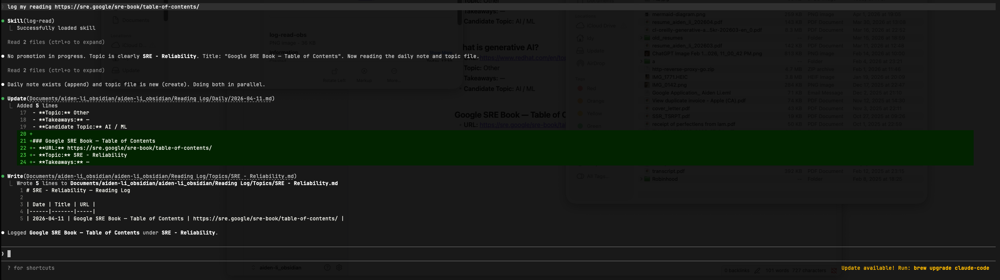
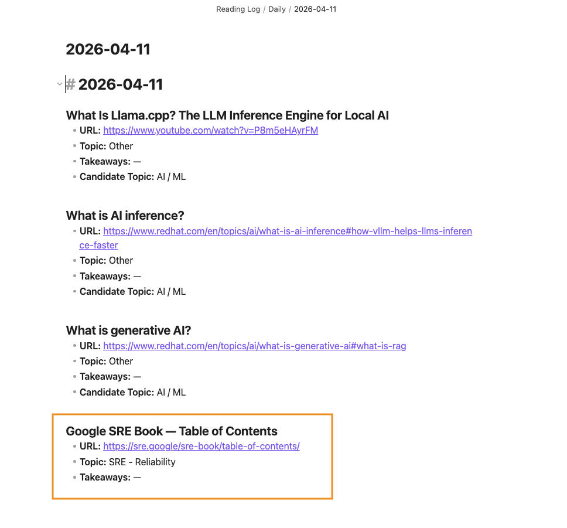
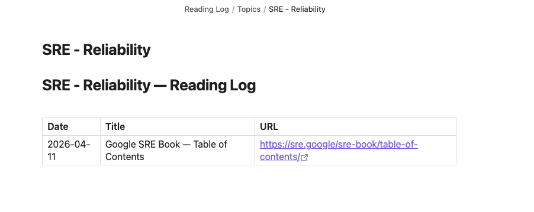
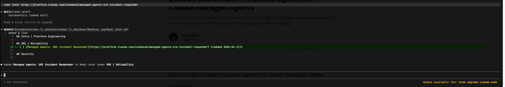
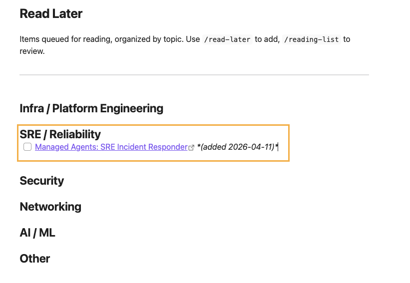
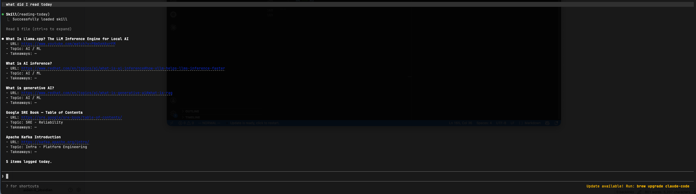
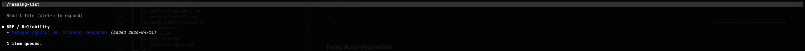
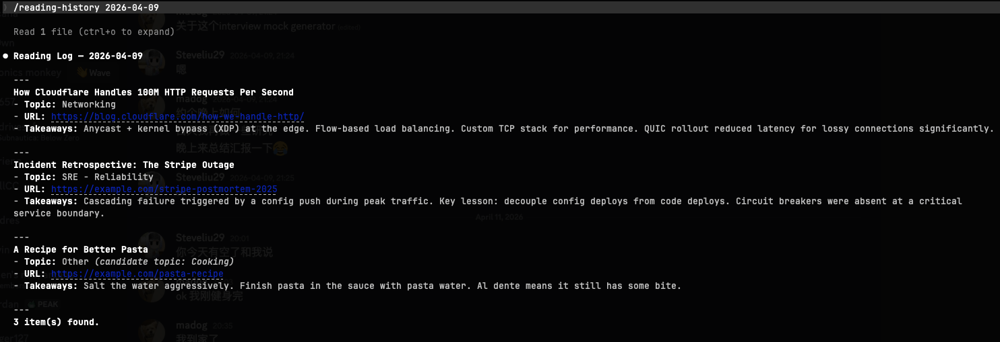
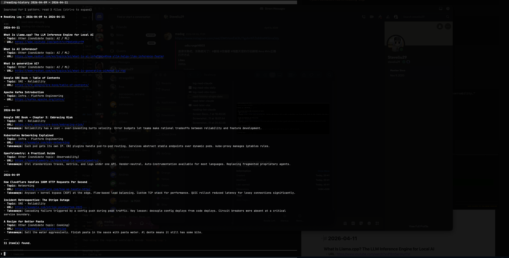

# reading-tracker

A personal knowledge harness built with Claude Code agent skills + Obsidian. Tracks what you read, maintains a read-later queue, and auto-promotes emerging topics — with no commands to memorize.

See [`docs/Reading Tracker Design Doc.md`](docs/Reading%20Tracker%20Design%20Doc.md) for architecture and tradeoff decisions.

---

## How It Works

Five Claude Code skills watch your conversation and react automatically:

| Skill | Triggers when you say... |
|-------|--------------------------|
| `log-read` | "I just finished reading...", "just read this article..." |
| `read-later` | "save this for later", "add to my list" |
| `reading-today` | "what did I read today?" |
| `/reading-list` | explicit command only |
| `/reading-history` | explicit command only |

All state is stored as plain markdown files in your Obsidian vault — no database, no server.

---

## Prerequisites

- [Claude Code](https://claude.ai/code) (any plan)
- [Obsidian](https://obsidian.md) with an existing vault

---

## Setup [Claude code can help you do the following]

### 1. Copy skills to your Claude skills directory

```bash
cp -r skills/log-read skills/read-later skills/reading-today skills/reading-list skills/reading-history ~/.claude/skills/
```

### 2. Update the vault path in each skill

Most skills have two hardcoded lines near the top. Replace them with your own vault path:

```
**Vault base:** `/your/obsidian/vault/Reading Log/`
**Vault config:** `/your/obsidian/vault/Reading Log/Config.md`
```

`reading-today` only has `Vault base` — no `Vault config` needed.

Files to update:
```
~/.claude/skills/log-read/SKILL.md
~/.claude/skills/read-later/SKILL.md
~/.claude/skills/reading-today/SKILL.md   ← vault base only
~/.claude/skills/reading-list/SKILL.md
~/.claude/skills/reading-history/SKILL.md
```

### 3. Set up the vault structure

Copy the templates into your vault:

```bash
cp vault-templates/Config.md vault-templates/Read\ Later.md vault-templates/Candidate\ Topics.md \
  "/your/obsidian/vault/Reading Log/"
```

Then create the required subfolders inside `Reading Log/`:

```
Reading Log/
├── Config.md
├── Read Later.md
├── Candidate Topics.md
├── Daily/
└── Topics/
```

### 4. Update Config.md

Open `Reading Log/Config.md` and adjust the Named Topics list and inference bias to match your reading focus.

---

## Usage

Just talk naturally in any Claude Code session:

```
"Just finished this article on eBPF — https://example.com. Really interesting take on observability."

"Save this for later: https://example.com/k8s-networking"

"What did I read today?"

/reading-list
/reading-list sre

/reading-history
/reading-history infra
/reading-history 2026-04-09          ← single date, returns only that day
/reading-history 2026-04-06..2026-04-09  ← date range, returns all days in range
```

### log-read example




### read-later example



### reading-today example


### reading-list example


### reading-history



---

## Topic Auto-Promotion [ I'll update a youtube video later ]

Reads that don't fit a named topic are filed under **Other** with a candidate topic label (e.g. "Databases"). When a candidate accumulates **3 logged reads**, it auto-promotes:

- A new `Topics/[T].md` is created with migrated entries
- `Config.md` is updated with the new topic
- `Read Later.md` gets a new section
- `Other.md` is cleaned up

The promotion is resilient: it uses additive-first ordering, idempotency checks, and a write-ahead log (`Promotion In Progress.md`) so it self-heals on the next run if interrupted.

You can query a candidate topic before it's promoted — e.g. `/reading-history cooking` will filter `Topics/Other.md` by the candidate label, and `/reading-list cooking` will filter `## Other` items. Results are labeled *(candidate topic — not yet promoted)*.

---

## File Structure

```
reading-tracker/
├── skills/
│   ├── log-read/SKILL.md
│   ├── read-later/SKILL.md
│   ├── reading-today/SKILL.md
│   ├── reading-list/SKILL.md
│   └── reading-history/SKILL.md
├── vault-templates/
│   ├── Config.md
│   ├── Read Later.md
│   └── Candidate Topics.md
└── docs/
    ├── Reading Tracker Design Doc.md
    ├── Single vs Multiple SKILL.md.md
    └── flowcharts.md
```
